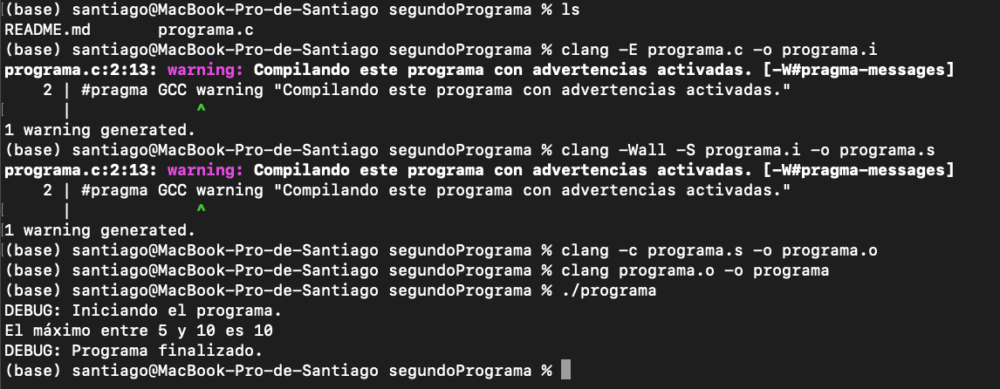

<h2>FUNCIONALIDAD DEL SEGUNDO PROGRAMA</h2>

<code>#include <stdio.h></code>: Incluye la cabecera estándar para funciones de entrada/salida

<code>#pragma GCC warning</code>: Genera una advertencia durante la compilación y muestra un mensaje

<code>#define MAX(a, b) ((a) > (b) ? (a) : (b))</code>: Define un macro que calcula el máximo entre dos números

<code>#ifndef DEBUG</code>: Verifica si DEBUG no está definida y si no lo está usa <code>#define DEBUG 1</code> para definirla con valor 1

<code>#ifdef DEBUG</code>: Si DEBUG está definida entonce define <code>#define log_debug(msg) printf("DEBUG: %s\n", msg)</code>

Por último, en main, se define <code>x = 5</code> y <code>y = 10</code>, se llama a <code>log_debug("Iniciando el programa.")</code> que mostrará el mensaje solo si DEBUG está activado

Llama a <code>printf("El máximo entre %d y %d es %d\n", x, y, MAX(x, y))</code> que mostrará el máximo entre los dos números

